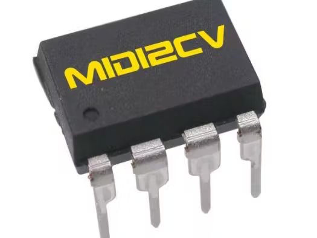
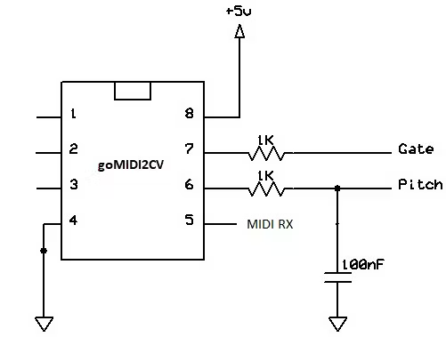
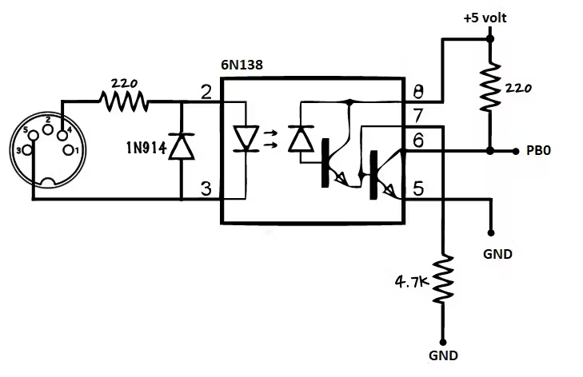
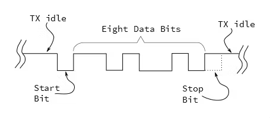

# goMIDI2CV  
Largely reworked version of the goMIDI2CV project by Jan Ostman.  

Original project: [https://www.hackster.io/janost/diy-good-ol-midi-to-cv-d0e2bf]  

## DIY Good Ol’ MIDI to CV 
The goMIDI2CV takes TTL-MIDI input and outputs a 1V/Octave CV and a gate signal.

## Story
_This is really a tutorial on how to use the USI component on the ATtiny as a UART-RX and MIDI is as good as any application for a UART._

_There are 3 additional unused outputs on the ATtiny45/85 that can be used for CV/Gates/Triggers or Sync. If you run this code on the ATtiny44/84 there is a total of 10 outputs that can be used._

What if you don’t like these fancy USB-MIDI converters or plain have a requirement to convert your MIDI keyboard to a CV/gate signal for some vintage gear?

Now you can.

The goMIDI2CV takes a TTL-MIDI input and outputs a 1V/Octave CV and a gate signal.

The code runs on a ATtiny45/85 microcontroller.

PB0 is the MIDI input.PB1 is the CV output.PB2 is the gate output

The MIDI-in is a TTL input and needs the usual optocoupler.

The CV-out is a PWM signal and needs a lowpass filter. Range is C2-C7, 0-5 volts.

The gate output is 5 volt for note-on and 0 volt for Note-off.

Note: The chip can run off MIDI ghost-power but for the CV to play in tune the supply voltage needs to be exactly 5 volts.

## Building blocks
There are 2 major basic components needed for making the converter:

* A D/A converter for the CV output
* A serial UART input for the MIDI

The ATtiny does not have a DAC so we create one using PWM.

And its also lacking a UART but we can use the USI component for that one.

    // (*) All in the spirit of open-source and open-hardware 
    // Janost 2019 Sweden  
    // DIY Good Ol' MIDI2CV on the ATtiny85
    // http://blog.dspsynth.eu/diy-good-ol-midi-to-cv/
    // Copyright 2019 DSP Synthesizers Sweden. 
    // 
    // Author: Jan Ostman 
    // 
    // This program is free software: you can redistribute it and/or modify 
    // it under the terms of the GNU General Public License as published by 
    // the Free Software Foundation, either version 3 of the License, or 
    // (at your option) any later version. 
    // This program is distributed in the hope that it will be useful, 
    // but WITHOUT ANY WARRANTY; without even the implied warranty of 
    // MERCHANTABILITY or FITNESS FOR A PARTICULAR PURPOSE. See the 
    // GNU General Public License for more details.

First we need to setup the chip. This code takes care of setting up the PWM and USI.

The fuses are important as we want to run the Tiny on a internal 16MHz clock.

    /Set Fuses to E1 DD FE for PLLCLK 16MHz
    //Global variables for the MIDI handler
    volatile uint8_t MIDISTATE=0;
    volatile uint8_t MIDIRUNNINGSTATUS=0;
    volatile uint8_t MIDINOTE;
    volatile uint8_t MIDIVEL;
      
    void setup() {
      // Enable 64 MHz PLL and use as source for Timer1
      PLLCSR = 1<<PCKE | 1<<PLLE;  
       
      // Set up Timer/Counter1 for PWM output
      TIMSK = 0;                     // Timer interrupts OFF
      TCCR1 = 1<<PWM1A | 2<<COM1A0 | 1<<CS10; // PWM A, clear on match, 1:1 prescale
      
      // Setup GPIO
      pinMode(1, OUTPUT); // Enable PWM output pin
      pinMode(0, INPUT);  // Enable USI input pin
      pinMode(2, OUTPUT); // Enable Gate output pin
      
      //Setup the USI
      USICR = 0;          // Disable USI.
      GIFR = 1<<PCIF;     // Clear pin change interrupt flag.
      GIMSK |= 1<<PCIE;   // Enable pin change interrupts
      PCMSK |= 1<<PCINT0; // Enable pin change on pin 0
      
      //Set scale of Timer1
      GTCCR = 0;
      OCR1C = 239; //Set count to semi tones
      OCR1A = 0; //Set initial Pitch to C2
      digitalWrite(2,LOW); //Set initial Gate to LOW;
    }

Next we need a pinchange interrupt to handle the start bit in the MIDI serial input.

MIDI is serial data at 31250bits/s so one bit time is 32 microseconds.

The start of a byte causes a pin-change interrupt. In the pin-change interrupt service routine we check that it’s a falling edge, and if so we set up Timer/Counter0 in CTC mode. We want to set up a delay of half a bit, to get into the middle of the start bit. The closest we can get to that is a prescaler of 8 and a compare match of 32. Finally we clear and enable the output compare interrupt.

    ISR (PCINT0_vect) {
      if (!(PINB & 1<<PINB0)) {       // Ignore if DI is high
        GIMSK &= ~(1<<PCIE);          // Disable pin change interrupts
        TCCR0A = 2<<WGM00;            // CTC mode
        TCCR0B = 0<<WGM02 | 2<<CS00;  // Set prescaler to /8
        TCNT0 = 0;                    // Count up from 0
        OCR0A = 31;                   // Delay (31+1)*8 cycles
        TIFR |= 1<<OCF0A;             // Clear output compare flag
        TIMSK |= 1<<OCIE0A;           // Enable output compare interrupt
      }
    }

The compare match interrupt occurs in the middle of the start bit. In the compare match interrupt service routine we reset the compare match to the duration of one bit, 64 (32uS), enable the USI to start shifting in the data bits on the next compare match, and enable the USI overflow interrupt.

    ISR (TIMER0_COMPA_vect) {
      TIMSK &= ~(1<<OCIE0A);          // Disable COMPA interrupt
      TCNT0 = 0;                      // Count up from 0
      OCR0A = 63;                     // Shift every (63+1)*8 cycles 32uS
      // Enable USI OVF interrupt, and select Timer0 compare match as USI Clock source:
      USICR = 1<<USIOIE | 0<<USIWM0 | 1<<USICS0;
      USISR = 1<<USIOIF | 8;          // Clear USI OVF flag, and set counter
    }

Note that we set the Wire Mode to 0 with 0<<USIWM0. This ensures that the output of the USI shift register won’t affect the CV output pin, PB1.

When 8 bits have been shifted in the USI overflow interrupt occurs. The interrupt service routine disables the USI, reads the USI shift register, and enables the pin change interrupt ready for the next byte.    

    ISR (USI_OVF_vect) {
    uint8_t MIDIRX;
    USICR = 0;                      // Disable USI         
    MIDIRX = USIDR;
    GIFR = 1<<PCIF;                 // Clear pin change interrupt flag.
    GIMSK |= 1<<PCIE; // Enable pin change interrupts again
      
    //Wrong bit order so swap it
    MIDIRX = ((MIDIRX >> 1) & 0x55) | ((MIDIRX  << 1) & 0xaa);
    MIDIRX = ((MIDIRX >> 2) & 0x33) | ((MIDIRX  << 2) & 0xcc);
    MIDIRX = ((MIDIRX >> 4) & 0x0f) | ((MIDIRX  << 4) & 0xf0);
      
    //Parse MIDI data
    if ((MIDIRX>0xBF)&&(MIDIRX<0xF8)) {
      MIDIRUNNINGSTATUS=0;
      MIDISTATE=0;
      return;
    }
    if (MIDIRX>0xF7) return;
    if (MIDIRX & 0x80) {
      MIDIRUNNINGSTATUS=MIDIRX;
      MIDISTATE=1;
      return;
    }
    if (MIDIRX < 0x80) {
    if (!MIDIRUNNINGSTATUS) return;
      if (MIDISTATE==1) {
        MIDINOTE=MIDIRX;
        MIDISTATE++;
      return;
      }
      if (MIDISTATE==2) {
        MIDIVEL=MIDIRX;
        MIDISTATE=1;
        if ((MIDIRUNNINGSTATUS==0x80)||(MIDIRUNNINGSTATUS==0x90)) {
        if (MIDINOTE<36) MIDINOTE=36; //If note is lower than C2 set it to C2
        MIDINOTE=MIDINOTE-36; //Subtract 36 to get into CV range
        if (MIDINOTE>60) MIDINOTE=60; //If note is higher than C7 set it to C7
        if (MIDIRUNNINGSTATUS == 0x90) { //If note on
        if (MIDIVEL>0) digitalWrite(2, HIGH); //Set Gate HIGH
        if (MIDIVEL==0) digitalWrite(2, LOW); //Set Gate LOW
        OCR1A = MIDINOTE<<2; //Multiply note by 4 to set the voltage (1v/octave)
      }
      if (MIDIRUNNINGSTATUS == 0x80) { //If note off
        digitalWrite(2, LOW); //Set Gate LOW
        OCR1A = MIDINOTE<<2; //Multiply note by 4 to set the voltage (1v/octave)
        }
      }
      return;
      }
    }

The UART sends the bits LSB first, whereas the USI assumes that the MSB is first, so we need to reverse the order of the bits after reception.

The MIDI parser is also included here.

Running status is what 99% of all MIDI synths and sequencers do today and it means that if the status byte is the same as the previous one its not transmitted which results in less bytes on the line.

Handling “Running status”:
1. Buffer is cleared (ie, set to 0) at power up.
2. Buffer stores the status when a Voice Category Status (ie, 0x80 to 0xEF) is received.
3. Buffer is cleared when a System Common Category Status (ie, 0xF0 to 0xF7) is received.
4. Nothing is done to the buffer when a RealTime Category message is received.
5. Any data bytes are ignored when the buffer is 0.

The parser handles running status and processes the noteon/noteoff and CV.

The 0x80, 0x90 and 0xB0 bytes here is MIDI status for Note-on, Note-off and MIDI-CC at channel #01. If you want some other receive channel, say channel #02, you change the lower nibble to 0x01, i.e 0x91.

Also a majority of transmitters use Note-on with zero velocity for Note-off.

The CV output is in the range C2 to C7 (0-5 volt) so we subtract 36 from the key to make C2 0 volts.

We also check if the note is above C7 which is 5 volts and limit it.

Then we write the key to the CV output.

8-bits is actually a too low resolution for the pitch but a trick makes it work.
The CV range is set to 0-239 instead of 255 and that makes each seminote exactly 4 steps.

If the event is a note-on we set the Gate output high and a note-off sets it low.

## Adding a pitchbend CV

The 240 note CV levels are too few steps to add pitchbend values, it will be noticeably steppy.

So we use another PWM output and CV that outputs the pitchbend value. That CV can be used separately or add it to the note CV through a 4.7K resistor.

Add this code to the setup and MIDI parser:

    //Setup addon for pitchbend output
    pinMode(4, OUTPUT); // Enable PB4 output pin for pitchbend CV
    GTCCR = 1<<PWM1B | 2<<COM1B0; // PWM B, clear on match
      
    //USI_OVF_vect addon
    if (MIDIRUNNINGSTATUS == 0xE0) { //If pitchbend data
    if (MIDIVEL<4) MIDIVEL=4; //Limit pitchbend to -60
    if (MIDIVEL>119) MIDIVEL=119; //Limit pitchbend to +60
    MIDIVEL-=4; //Center the pitchbend value
    OCR1B = (MIDIVEL<<1); //Output pitchbend CV
    } 
